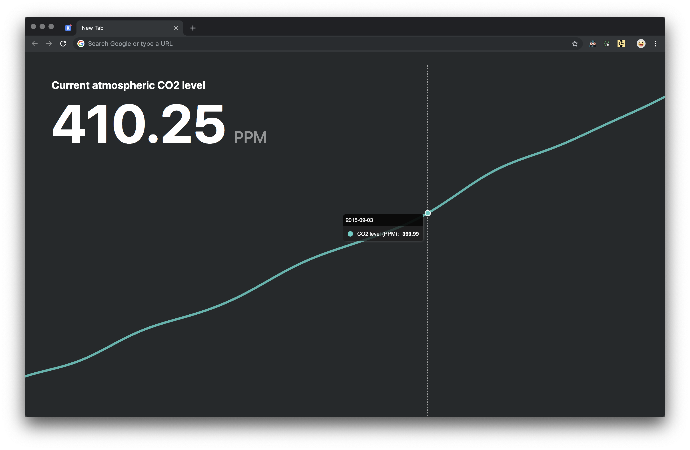

<h1 align="center">Carbon Tab</h1>
<p align="center">🌎🏭📈 Data about the climate crisis, in your new tab.</p>
<p align="center"><a href="https://chrome.google.com/webstore/detail/carbon-tab/hdbbmlahkjjgopapilkbeohfaooipafa" target="_blank"></a></p>
<a href="https://chrome.google.com/webstore/detail/carbon-tab/hdbbmlahkjjgopapilkbeohfaooipafa" target="_blank"></a>

## Development set-up instructions
To get started, clone the repo:
```
https://github.com/Booligoosh/carbon-tab.git
cd carbon-tab
```
If yarn isn't already installed, run:
```
npm install yarn -g
```
Then install the dependencies for Carbon Tab:
```
yarn install
```
To build the extension, run
```
yarn build:dev
```
You can get Webpack to auto-rebuild every time you change a file:
```
yarn watch:dev
```
If you want to package the extension into a zip file, use the following command:
```
yarn build-zip
```
